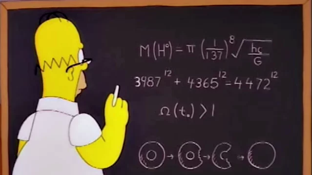

# Theory-of-Algorithms

## Post Correspondence
Inside the folder called Assignment you will find a notebook that talks about the [Post Correspondence Problem](Assignment/PostCorrespondenceProblem.ipynb) and the [Bound Correspondence Problem](Assignment/PostCorrespondenceProblem.ipynb). 
***
## Technologies 

The technologies that are used for this are [Python](https://docs.python.org/3/) and [Jupyter](https://docs.jupyter.org/en/latest/) where the blend of both are used to work on the assigment given.
[Pandas](https://pandas.pydata.org/getting_started.html) was used for the analytical uses in the notebook. And then [numpy](https://cs231n.github.io/python-numpy-tutorial/) was used for its scientific computing.
***
### Undecidable Problem in Computability Theory
Is a decision problem that any random yes or no question where it has a infinite set of inputs. This is a usual way to define the decision problem that correspond as the set of inputs where the problem returns as true. The inputs can be anything from a number to a string from a [formal language](https://en.wikipedia.org/wiki/Formal_language). And then by using [Godel numbering](https://en.wikipedia.org/wiki/G%C3%B6del_numbering) to do some encoding for the strings to be turned into natural numbers. This then lets a phrase to be passed as a set of natural numbers, which makes it easier to define. If a problem is passed into a Turing Machine to give back a solution which is actually a contradition that is entered it can cause the Turing Machine to run forever to find the right values of n, a, b, c. But we arent sure if a contradiction atutally exists and thus this becomes an Undecidable Problem.

#### **Undecidable Problems**
Is that when we have problems we can't make an algorithm that can give us an answer to the problem properly in finite time are usually called Undecidable Problems. These problems can actually be practically decidable but they will infact ever be decidable. And that means that there will always be a condition that will always make the Turing Machine go into a infinite loop and will never give the user an answer.
There is a way of actually understanding the Undecidable Problems intuitively from looking at Fermats Theorem which says not 3 positive Integers can ever please the equation:

$$ x^n + y^n = z^n $$
##### **Fermats Theorem** 
- Is said to be actually called Fermats Last Theorem where that the sides of a right angled triagle is 3^2 + 4^2 = 5^2 and always will be but if you change it to 3^3 + 4^3 != 5^3 and according to Fermat that if you change n from 2 it will never be the right answer that you get. And after 350 years [Andrew Wiles](https://en.wikipedia.org/wiki/Wiles%27s_proof_of_Fermat%27s_Last_Theorem) came up with a solution for why these equations couldnt be solved. Also with Fermats Theorem an odd^n + even^n = odd^2 and cannot be equal to an even number IE: odd^n + even^n != even^2 
##### **Wiles's proof of Fermat's Last Theorem**
- It took Sir Andrew Wiles 7 years to get his proof to be correct in trying to prove that Fermats last theorem was infact true. It became clear to a few others that it could actually be proven to be correct by other mathematicians. When it was still unproven it was actually called Taniyama–Shimura–Weil conjecture at time. The modular theorem actually had elliptic curves in it and this was Wiles own specialist area. After 6 or so years of releasing small bits of his work he held a 3 day lecture and on the 3rd day he had proved that Fermats Theorem was true. Thus proving that the Undecidable Problem is correct.

#### Comparison 
- With the Undecidable Problem and the PCP they have alot in common. Where both need to both be compared to something and will only be equal to one right answer and there cannot be any other answer as stated in the Undecidable Problem you can have 3^2 + 4^2 = 5^2 but once to change the number from being squared to cubed or to a higher number then it will never be equal IE: 3^3 + 4^3 != 5^3.

#### How and Why
- If 3^2 + 4^2 = 25 and 5^2 = 25 which makes 3^2 + 4^2 = 5^2 correct. And if you have 3^3 + 4^3 = 81 and 5^3 = 125 then also makes 3^3 + 4^3 != 5^3 correct in saying that they can never be equal. And this is works for PCP if you have a3,a2,a3,a1 = bba + ab + bba + a = bbaabbbaa = bb + aa + bb + baa = b3,b2,b3,b1 they are both the same but and will always be correct but then if you change one character such as a3,a2,a3,a1 = bba + ab + bca + a = bbaabbbaa = bb + aa + bb + baa = b3,b2,b3,b1 they are not the same and will always be False or never the same as each other.

#### Homer's Near miss 
- In an episode of The Simpsons Homer wants to become an inventor and there is a scene where is at a blackboard doing an equation that has 3987^12 + 4365^12 = 4472^12 this is what is called a near miss and it somehow almost works out but if you were to do it on a phone calculator it will show up as being correct but if you do it on a scientific calculator it will show up to 12-15 decimal places and actually show that it is wrong.
 

 
Here is a video explaining more of how they added it in and why [Homers Theorem](https://youtu.be/ReOQ300AcSU).

***
## Refrences
1. Andrew Wiles proof of Fermats Theorem [here](https://en.wikipedia.org/wiki/Wiles%27s_proof_of_Fermat%27s_Last_Theorem)
2. A video giving a quick explaination of [Fermats](https://www.youtube.com/watch?v=1BSFyEIY2BY)
3. GeeksOfGeeks Decidable & Undecidable Problems [here](https://www.geeksforgeeks.org/decidable-and-undecidable-problems-in-theory-of-computation/)
4. Repo used for idea on how to do the [Countdown game solver](https://github.com/Vonatzki/countdown_game_number_solver/blob/master/Countdown%20Game%20Show%20Number%20Solver.ipynb) 